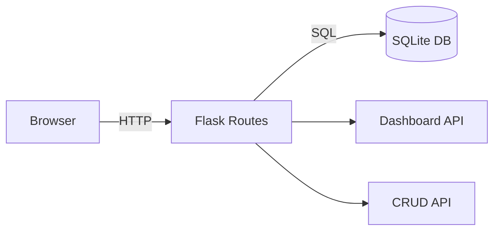

# Project Management Tool

[](https://www.python.org/)
[](https://flask.palletsprojects.com/)
[](https://www.sqlite.org/)
[](LICENSE)

[Portugues](#portugues) | [English](#english)

---

## Portugues

### Visao Geral

Aplicacao web single-file (~307 linhas) em Flask com backend SQLite para gerenciamento de projetos e tarefas.

### Funcionalidades

- CRUD de projetos e tarefas com persistencia em SQLite
- Dashboard com estatisticas de projetos e tarefas
- Interface web com cards de projetos e tarefas
- Dados de exemplo carregados automaticamente no primeiro uso

### Arquitetura



### Inicio Rapido

```bash
# Clonar o repositorio
git clone https://github.com/galafis/Project-Management-Tool.git
cd Project-Management-Tool

# Criar ambiente virtual
python -m venv venv
source venv/bin/activate  # Windows: venv\Scripts\activate

# Instalar dependencias
pip install -r requirements.txt

# Executar
python project_manager.py
```

A aplicacao estara disponivel em `http://localhost:5000`.

### Estrutura do Projeto

```
Project-Management-Tool/
├── project_manager.py   # Aplicacao Flask (rotas, modelos, template)
├── requirements.txt     # Dependencias (Flask, pytest)
├── tests/
│   ├── __init__.py
│   └── test_main.py     # Testes com Flask test_client
├── LICENSE
└── README.md
```

### Testes

```bash
pytest tests/ -v
```

### Autor

**Gabriel Demetrios Lafis**
- GitHub: [@galafis](https://github.com/galafis)
- LinkedIn: [Gabriel Demetrios Lafis](https://linkedin.com/in/gabriel-demetrios-lafis)

---

## English

### Overview

Single-file Flask web application (~307 lines) with SQLite backend for project and task management.

### Features

- CRUD for projects and tasks with SQLite persistence
- Dashboard with project/task statistics
- Web UI with project and task cards
- Sample data loaded automatically on first run

### Architecture


### Quick Start

```bash
# Clone the repository
git clone https://github.com/galafis/Project-Management-Tool.git
cd Project-Management-Tool

# Create virtual environment
python -m venv venv
source venv/bin/activate  # Windows: venv\Scripts\activate

# Install dependencies
pip install -r requirements.txt

# Run
python project_manager.py
```

The application will be available at `http://localhost:5000`.

### Project Structure

```
Project-Management-Tool/
├── project_manager.py   # Flask app (routes, models, template)
├── requirements.txt     # Dependencies (Flask, pytest)
├── tests/
│   ├── __init__.py
│   └── test_main.py     # Tests using Flask test_client
├── LICENSE
└── README.md
```

### Tests

```bash
pytest tests/ -v
```

### Author

**Gabriel Demetrios Lafis**
- GitHub: [@galafis](https://github.com/galafis)
- LinkedIn: [Gabriel Demetrios Lafis](https://linkedin.com/in/gabriel-demetrios-lafis)

### License

This project is licensed under the MIT License - see the [LICENSE](LICENSE) file for details.
